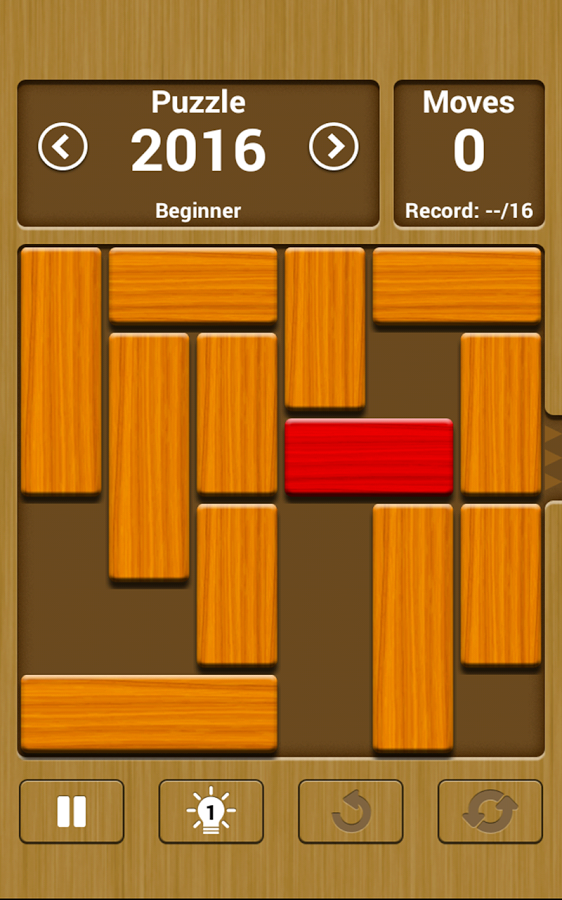
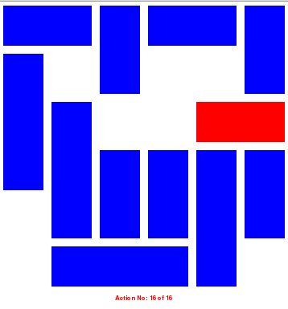

# Unblockme

[](https://nodesource.com/products/nsolid)

Unblockme solves traditional unblockme's puzzles using different search algorithms and displays interactive solutions.

<p align="center">
	
</p>

### Features!
  - Reads puzzles from text files.
  - Uses search algorithms such as: BFS (Breadth First Search), DFS (Deep First Search).
  - Displays solutions using step-by-step mode. You can press **left** and **right arrow keys** to move backward and forward.
  - Displays solutions using autoplay mode.

<p align="center">
	
</p>


### Pre-requisites!
- [Python 2.7](https://www.python.org)  
- [PyGame](https://www.pygame.org)

### Usage

```sh
python unblockme.py [-h] [--BFS] [--DFS] [--auto-play] [--step-by-step] filename
```

| Options | Descripton |
| ------ | ------ |
| --DFS | Use Depth First Search  algorithm.|
| --BFS | Use Breadth First Search algorithm.|
| --autoplay | Visualize solutions using autplay mode. |
| --step-by-step | Visualize solutions using step-by-step mode.|

For example, you can solve a puzzle contained in **puzzles_data/puzzle01.txt** using **BFS's search algorithm** and display solution in **step-by-step** mode.

```sh
python unblockme.py --BFS --step-by-step puzzles_data/puzzle01.txt
```
Or you can can solve the same puzzle  using **DFS's search algorithm** and display solution in **autoplay** mode.

```sh
python unblockme.py --DFS --autoplay puzzles_data/puzzle01.txt
```

### Puzzle's file format!

Any puzzle can be defined in a single text file using the following format rules:

   - Every single block is expresed on each line.
   - The objective block is expresed on the first line.
   - Every line contains the following block atrributes separated by commas:
    	- **Orientation:** horizontal (**H**) or vertical (**V**)
    	- **Size:** an integer value to set the block size.
    	- **Row:** an integer value between **0**  and **5**.
    	- **Column:** an integer value between **0**  and **5**.
  
You can look some puzzles files samples in the folder **puzzles_data**.

License
----
GPL

**Free Software, Hell Yeah! Another options stink...**